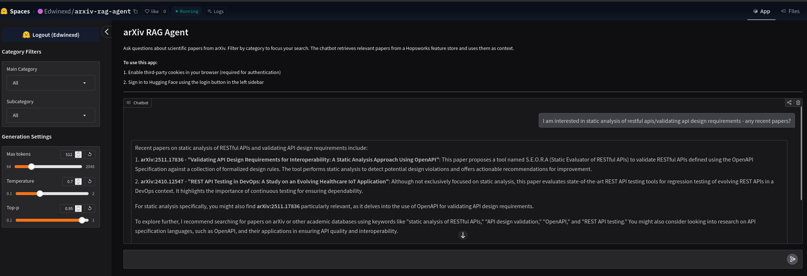
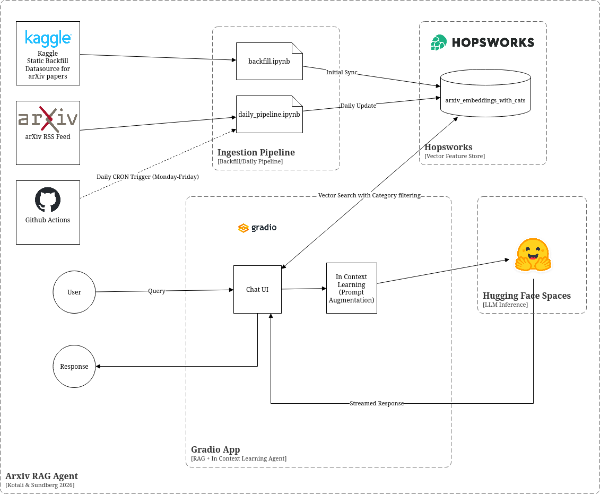

# ArXiv RAG Agent

A scalable Retrieval-Augmented Generation (RAG) system for scientific research, developed for the Scalable Machine Learning course at KTH. This agent embeds daily ArXiv preprints and provides a conversational interface to explore and understand the latest research.



## Features

*   Daily Automated Ingestion: Automatically fetches and embeds new ArXiv preprints every weekday via GitHub Actions.
*   Vector Feature Store: Utilizes Hopsworks as a centralized vector database for efficient similarity search.
*   Context-Aware Research Assistant: Uses Llama 3.3 70B (via Hugging Face Inference API) to answer queries grounded in ArXiv metadata and full paper text.
*   Intelligent Retrieval:
    *   Semantic search using all-MiniLM-L6-v2 embeddings.
    *   Category-based filtering (Computer Science, Physics, Mathematics, etc.).
    *   Real-time fetching of full paper content from ArXiv HTML versions for deep context.
*   User Interface: Interactive chat interface built with Gradio and deployed on Hugging Face Spaces.

## Architecture



The system consists of three main components:

1.  Ingestion Pipeline (notebooks/):
    *   backfill.ipynb: Ingests historical data from data/arxiv_v2.csv into the feature store.
    *   daily_pipeline.ipynb: Fetches the latest RSS feed from ArXiv, generates embeddings, and performs upserts to Hopsworks.
2.  Feature Store (Hopsworks):
    *   Stores embeddings, paper IDs, and category mappings in a arxiv_embeddings_with_cats feature group.
3.  RAG Agent (gradio/):
    *   Retriever: Queries Hopsworks for semantically similar papers.
    *   Augmenter: Scrapes full text from ArXiv HTML and gathers metadata via the ArXiv API.
    *   Generator: Prompts Llama 3.3 70B with the retrieved context to generate streaming responses.

## Installation & Setup

### Prerequisites
*   Python 3.11
*   Hopsworks account (app.hopsworks.ai)
*   Hugging Face account (for Inference API)

### Local Development
1. Clone the repository:
   ```bash
   git clone https://github.com/Edwinexd/arxiv-rag-agent.git
   cd arxiv-rag-agent
   ```

2. Install dependencies:
   ```bash
   pip install -r requirements.txt
   ```

3. Set up environment variables:
   Create a .env file or export the following:
   ```bash
   export HOPSWORKS_API_KEY="your_api_key"
   export HOPSWORKS_FEATURE_STORE="your_project_name"
   ```

4. Run the Gradio app:
   ```bash
   cd gradio
   python app.py
   ```

## Automation

The project uses GitHub Actions for continuous operation:
*   Daily Pipeline: Runs Monday-Friday at 06:00 UTC to sync the feature store with the latest papers.
*   HF Space Sync: Automatically deploys updates in the gradio/ directory to Hugging Face Spaces.

## Project Structure

```
├── .github/workflows/       # Automation pipelines
├── data/                    # Local datasets and category mappings
├── gradio/                  # RAG Agent source code and requirements
├── notebooks/               # Feature engineering and ingestion pipelines
├── architecture.png         # System design overview
└── requirements.txt         # Pipeline dependencies
```